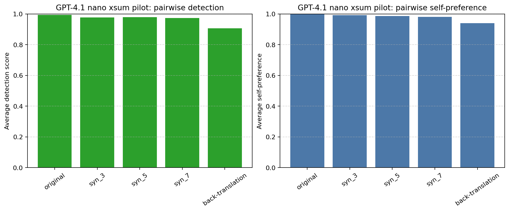
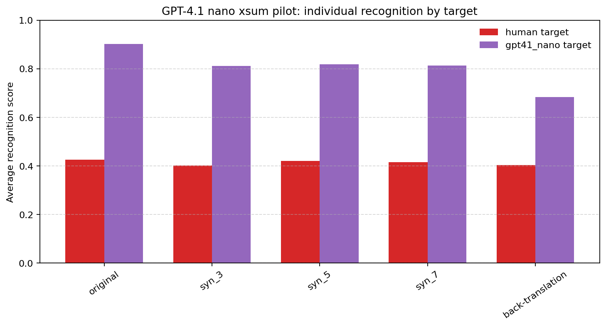

# Self Recognition in LLM Evaluators

Research workspace for studying whether language models:

- recognize their own generations,
- prefer their own generations over alternatives,
- keep that preference after paraphrasing or synonym-level interventions.

The repository started as a replication of the "LLMs Prefer Their Own Generations" setup on summarization, and now also includes notebook-based follow-up work with `gpt-4.1-nano` and `claude-3-haiku`.

## Current Scope

The main committed experiments are on summarization:

- `xsum`: one-sentence summaries
- `cnn`: multi-line highlight summaries

The current baseline sources in code and artifacts are:

- `human`
- `claude` (`claude-2.1` legacy files)
- `claude3` (`claude-3-haiku-20240307`)
- `gpt35`
- `gpt4`
- `gpt41_nano`
- `llama`

There are also legacy fine-tuned/control variants for GPT-3.5 and LLaMA, including:

- `2`, `10`, `500` example fine-tunes
- `always_1`
- `random`
- `readability`
- `length`
- `vowelcount`

## What Is In The Repo

### Notebooks

- `replication.ipynb`
  Notebook-first replication workflow for newer models. It generates `gpt41_nano` and `claude3` summaries, applies cleaning, then runs pairwise preference, recognition, and scoring evaluations.
- `experiments.ipynb`
  Intervention notebook for the new follow-up study. It selects high self-recognition or high self-preference `xsum` cases, creates paraphrases by back-translation and low-probability synonym replacement, then reruns evaluations.
- `replication_analysis.ipynb`
  Newer analysis notebook for tables and plots over the replicated runs.
- `analysis.ipynb`
  Older analysis notebook for the original summarization experiments and legacy model comparisons.

### Python Modules

- `data.py`
  Dataset/source registry plus JSON helpers.
- `models.py`
  OpenAI/Anthropic model calls for summary generation, pairwise choice, recognition, and scoring.
- `prompts.py`
  Prompt templates for summarization, detection, comparison, and scoring.
- `experiments.py`
  Core experiment runners for pairwise logprob results, recognition results, and score results.
- `data_cleaning.py`
  Cleanup helpers for human and Claude-style summaries.
- `generate_summaries.py`
  Older script for generating summary files for fine-tuned variants.
- `llama_prompts.py`, `llama_finetune.py`, `llama_eval.py`
  Legacy LLaMA prompt generation, fine-tuning, and evaluation utilities.

### Artifact Folders

- `articles/`
  Cached article subsets. The committed `cnn` and `xsum` article files each contain 1,000 examples.
- `summaries/`
  Cached generated summaries and intervention outputs.
  Top-level files hold baseline/new-model outputs such as `xsum_train_gpt41_nano_responses.json`.
  Nested `summaries/xsum/` and `summaries/cnn/` mostly hold older fine-tuned-model outputs.
- `results/`
  Pairwise self-recognition and self-preference results.
- `individual_setting_results/recognition_results/`
  Single-summary recognition runs asking whether a model wrote a summary.
- `individual_setting_results/score_results/`
  Single-summary 1-5 quality scoring runs.
- `label_results/`
  Label-ablation experiments with correct, wrong, and random source labels.
- `temp_autosaves/`
  Partial autosaves for long-running evaluations.

## Current Artifact State

As committed in this workspace on April 1, 2026:

- `articles/xsum_train_articles.json` and `articles/cnn_train_articles.json` each contain 1,000 articles.
- Baseline summary files for `gpt4`, `gpt41_nano`, and human references contain 1,000 summaries per dataset.
- `claude3` summary files are present for both `xsum` and `cnn`, also with 1,000 summaries each.
- Legacy `gpt4` and `gpt35` pairwise result files contain 4,000 rows per dataset.
- Current `gpt41_nano` pairwise result files contain 200 rows per dataset.
- New intervention pilot files exist for `xsum`:
  - pairwise paraphrase sets: 79 summaries each for `pp_base`, `pp_syn_3`, `pp_syn_5`, `pp_syn_7`
  - individual-recognition sets: 55 summaries each for `ind_base`, `ind_syn_3`, `ind_syn_5`, `ind_syn_7`

## Pilot Figures

These are the most useful README-level figures from `experiments.ipynb`, cleaned into static files in `figures/`.



Pairwise pilot on selected `xsum` examples (`n=79`, human comparison only). Detection stays near ceiling under synonym replacement and drops more clearly under back-translation. Self-preference also declines under intervention, but more mildly than the back-translation detection drop.



Individual pilot on selected `xsum` examples (`n=55` per target). This figure is split by target because the raw notebook summary bar chart mixes `human` and `gpt41_nano` targets in a way that is easy to misread. On the current pilot subset, human-target recognition stays roughly flat, while self-target recognition drops under both synonym edits and back-translation.

## Recommended Workflow

If you want to understand or continue the current project, start here:

1. Open `replication.ipynb` for generation and fresh evaluation runs on `gpt41_nano` and `claude3`.
2. Open `replication_analysis.ipynb` for the current analysis tables and plots.
3. Open `experiments.ipynb` for the paraphrase/synonym intervention study.
4. Use the Python scripts only when you want to rerun pieces outside the notebook flow.

The newer work is notebook-driven. The scripts are still useful, but the latest project logic is not centralized into a clean package or CLI.

## Setup

Create an environment and install dependencies:

```bash
python -m venv .venv
. .venv/bin/activate
pip install -r requirements.txt
```

On Windows PowerShell:

```powershell
python -m venv .venv
.venv\Scripts\Activate.ps1
pip install -r requirements.txt
```

Environment variables used across the repo:

- `OPENAI_API_KEY`
- `ANTHROPIC_API_KEY`
- `HF_TOKEN`

Example `.env`:

```env
OPENAI_API_KEY=...
ANTHROPIC_API_KEY=...
HF_TOKEN=...
```

Notebook-specific notes:

- `replication.ipynb` expects OpenAI and Anthropic keys.
- `experiments.ipynb` installs extra notebook-only dependencies such as `sacremoses` and uses MarianMT back-translation models.
- `data_cleaning.py` and notebook cells download NLTK resources on demand.

## Main Experiment Types

### Pairwise Detection And Preference

Implemented mainly in `experiments.py` via `generate_gpt_logprob_results(...)`.

For a model and article:

- show two summaries,
- ask which summary the model wrote,
- ask which summary it prefers,
- aggregate forward/backward orderings into:
  - `detection_score`
  - `self_preference`

### Individual Recognition

Implemented via `generate_recognition_results(...)`.

For a single summary:

- ask whether the evaluator wrote it,
- record a `recognition_score`,
- compare against ground truth.

### Individual Scoring

Implemented via `generate_score_results(...)`.

For a single summary:

- ask for a 1-5 score,
- keep token-level probabilities,
- analyze whether own generations are scored more favorably.

### Label Ablations

Stored in `label_results/`.

These runs test how source labels affect preference under:

- correct labels
- wrong labels
- random labels

### Paraphrase / Causal Intervention Pilots

Implemented in `experiments.ipynb`.

Current intervention types:

- back-translation baseline (`pp_base`, `ind_base`)
- low-probability synonym replacement (`syn_3`, `syn_5`, `syn_7`)

The point of these pilots is to test whether weakening surface-form similarity weakens self-recognition or self-preference.

## Known Rough Edges

This repository is a research workspace, not a polished package. A few things are currently inconsistent:

- The newest workflow lives mostly in notebooks, not reusable CLI commands.
- Naming is partly legacy. Some older artifacts live in nested dataset folders while `load_data()` expects top-level files like `summaries/{dataset}_train_{source}_responses.json`.
- `experiments.ipynb` references `plotting_funcs.py`, but that helper is not currently committed in this repository.
- `models.py` includes `claude3` and `gpt41_nano` model ids, but the older helper functions are still shaped around the legacy script workflow.

## Research Backlog

These items come from the current task notes and are grouped here as the working roadmap.

### Active Replication / Evaluation

- add comparison with Claude Haiku
- run 100 examples for `gpt41`
- compare which it prefers: original or paraphrased
- record which model prefers its own summaries
- get results and graphs matching the paper as closely as possible
- implement summarization comparison on own-generation vs other-generation summaries for 5-10 inputs

### Cleaning / Data Checks

- check Claude summary formatting:
  - `highlights`
  - `1. `
  - `- `
  - trailing periods
  - `key highlights`
- check whether `gpt41` responses end with a trailing period
- check whether initial articles need cleaning
- check whether human responses need cleaning

### Extensions

- extend the preference task to one new domain: `recipes` or `reasoning`
- play human judge
- add comparison with debate-style evaluation
- pick 2-3 difficult true/false riddles
- use a prompting loop with Pro vs Con agents (`GPT-4o mini`)
- test whether results hold in other languages

### Debate / Alignment Follow-Ups

- log whether debate reveals anything a single model does not
- test whether debate helps on tasks humans can still verify
- avoid settings where obfuscated arguments or hard-to-check branches dominate
- consider whether debate can be made robust with prompting/few-shot methods, since training is out of scope here

## Working Hypotheses And Notes

These are the main research notes already reflected in the notebooks and task log:

- A key example-level hypothesis is that paraphrasing may reduce self-recognition without changing semantics.
- One current observation is that synonym changes do not obviously remove self-recognition, and may sometimes even improve it.
- A more careful interpretation of the current `gpt41_nano` intervention plots is that self-recognition is not driven only by exact surface-form likelihood. Low-probability synonym edits do not destroy recognition, and in the current pilot they can even raise individual recognition scores.
- The pairwise and individual settings appear to measure different things. Pairwise detection stays near ceiling for the synonym variants and drops more clearly only for back-translation, while individual recognition rises relative to the base condition on the current selected examples.
- So the current pilot does not support the simpler "edited text looks like a worse version of the model's writing, therefore individual recognition should fall" story. If anything, the synonym-edited summaries may look more canonically model-like in isolation even when they are somewhat worse as summaries.
- These claims should still be treated as tentative because the intervention study currently uses small, selected subsets rather than a broad random sample.
- The project is leaning toward the view that self-recognition is not only a shallow lexical-match effect.
- For `xsum`, trailing periods matter for normalization; for `cnn`, line splitting and highlight formatting matter.
- Coding tasks may be less promising for this question because correctness constraints dominate style.

## Suggested Next Steps

If you resume work from the current state, the highest-signal next sequence is:

1. finish the `gpt41_nano` 100-example replicated runs,
2. standardize cleaning for Claude, human, and `gpt41_nano` summaries,
3. finalize the original-vs-paraphrased comparison tables,
4. reproduce the paper-style graphs in `replication_analysis.ipynb`,
5. then extend to one new domain such as reasoning or recipes.
